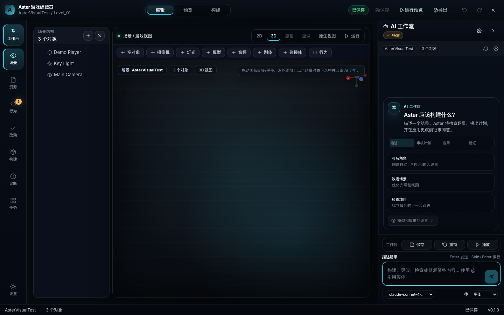
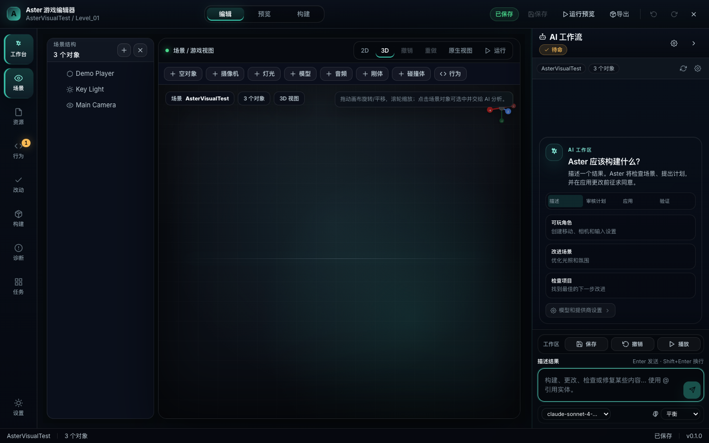
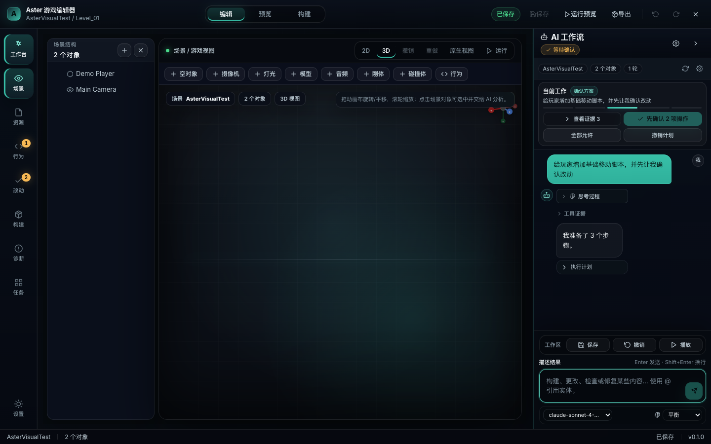
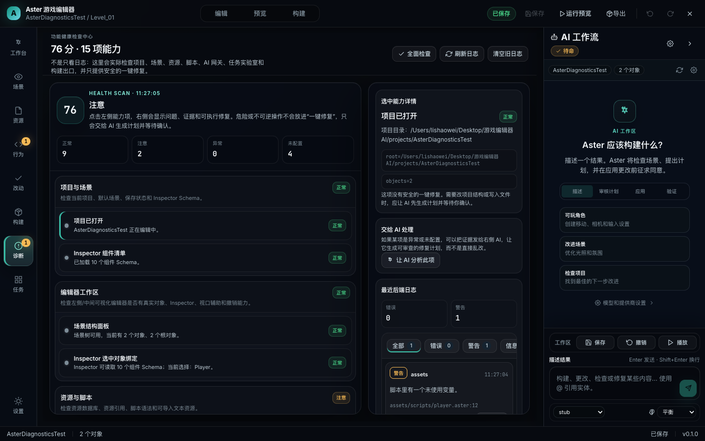
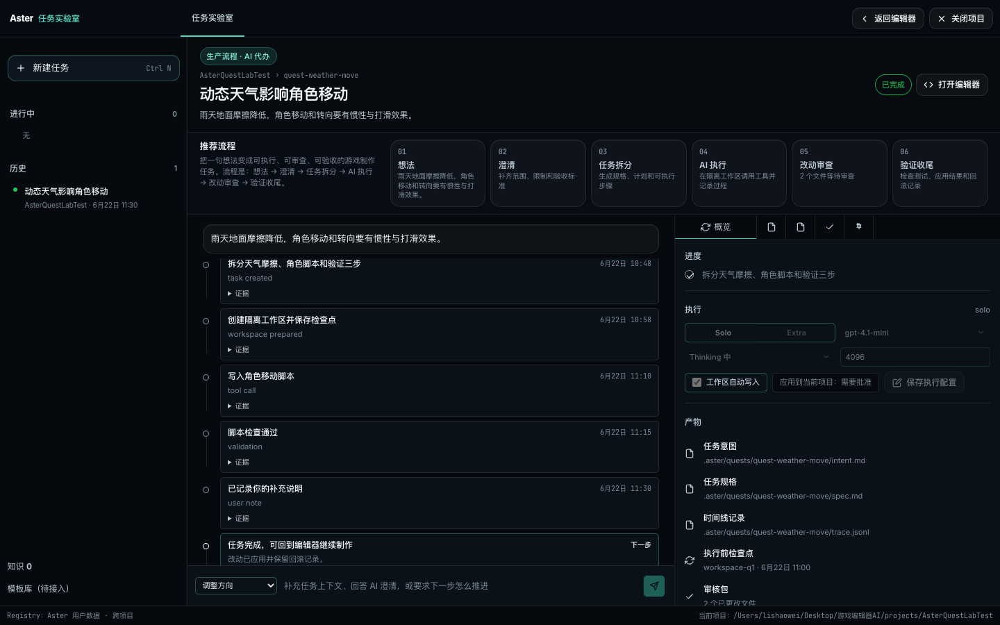

# Aster AI 游戏编辑器接手成果展示（2026-06-22）

这份文档用于给维护者快速评审本分支的成果：当前改动目标不是做一个空壳演示，而是把 Aster 往“AI-first 游戏编辑器工作台”推进，并确保普通用户能通过 AI 完成制作，同时开发者能审查、验证、回滚。

## 本轮核心成果

1. **主编辑器改成专业工作台方向**
   - 中央保持可视化场景编辑器，不让 AI 面板抢占主场。
   - 右侧 AI 面板默认约占窗口 1/4，可拖拽调整。
   - 按钮尺寸、面板边界、焦点态和暗色层级已按生产工具方向调整。
   - 品牌主色从偏绿色改为更冷的青蓝：`#3BC3DD` / `#78DFF0`，避免本地显示成“绿按钮”。

2. **右侧 AI 面板改为聊天优先**
   - 聊天输入始终可见。
   - 计划、工具调用、证据默认折叠，不挡聊天记录。
   - AI 申请写入/执行时保留“允许/拒绝/应用/撤销”的审查流。
   - 空状态不再像小游戏引导，而是专业地告诉用户“描述结果 → 审核计划 → 应用 → 验证”。

3. **设置与模型网关方向补齐**
   - 设置页保留返回路径，避免进入后退不出来。
   - 默认中文，设置中保留中文/英文切换。
   - 模型配置面向 OpenAI 兼容/中转站：URL、Key、模型等入口已按真实配置流设计。

4. **诊断中心改为功能健康检查中心**
   - 覆盖项目/场景、编辑器工作区、资源脚本、控制台、AI 网关、语言设置、任务实验室、构建导出。
   - 有安全的一键修复动作，例如清控制台、重扫资源、保存场景。
   - 未完成能力不会伪装成已完成，而是给出状态、证据和下一步建议。

5. **任务实验室明确为生产流程**
   - 流程：想法 → 澄清 → 任务拆分 → AI 执行 → 改动审查 → 验证/回滚。
   - 页面补了返回编辑器能力。
   - 任务执行、应用、备注等路径接真实 RPC/mock 验证，不是纯静态壳。

## 截图

### 主界面：命令甲板方向



### 可视化编辑器仍是主场



### AI 面板：聊天优先、证据折叠



### 诊断中心



### 任务实验室



## 已验证命令

```bash
cd editor
bunx tsc --noEmit
bun run build
# 本地额外验证：Playwright command-deck visual smoke（截图已随本文档提交）
```

补充：此前还跑通过了视口、AI 工作流、诊断中心、任务实验室等 Playwright smoke。相关截图已随本文档提交，维护者可以先通过截图和代码 diff 评审；后续建议把这些 smoke 脚本整理进仓库内的正式测试目录。

## 已知非阻塞问题

- `bun run build` 仍有 Vite chunk 超过 500KB 的提示，当前不影响运行；后续建议做代码拆分。
- 还有一些历史功能正在走“真实能力补齐”路线，未完成项应继续保持禁用或标注“规划中/待补齐”，避免假按钮。

## 建议合并判断

建议作为“AI-first 编辑器接手基础分支”合并或继续在此分支上迭代。它已经把 Aster 从原本分散的编辑器/AI 功能推进到一个更清晰的产品方向：左侧/中间做游戏编辑，右侧 AI 负责计划、工具、审查和执行记录。
